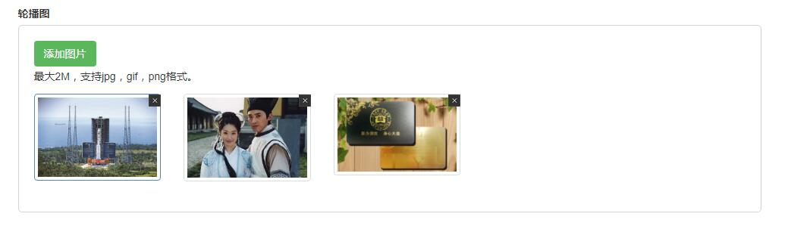
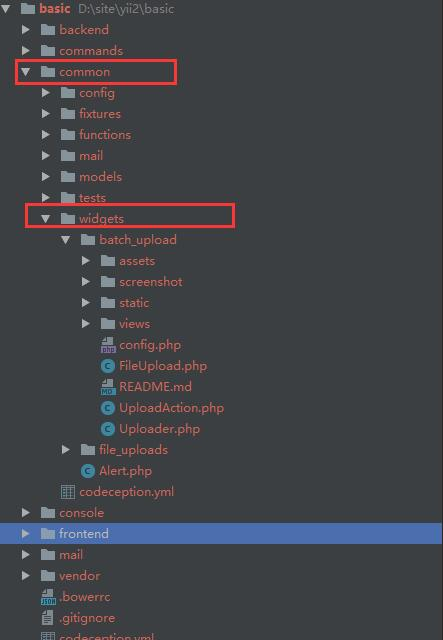

# Yii2-batch-upload
Yii2多图片上传
# 功能说明
此小部件实现了文章或项目添加的时候，可以传多张图片，也以对上传成功的图片进行删除（如果trueDelete为真， 则服务器上的真实图片也会删除）

此小部件不能在上传图片的时候， 选N张图片，只能一张一张的选择进行上传

# 安装说明
将下载的文件夹放入公共目录，本实例路径为（/common/widgets/），请根据项目实例自行安排，
UploadAction.php文件内有使用说明，请进行参考。

上传图片插件为AjaxUpload3.9，无刷新上传图片，使用前， 请查看config.php进行配置，默认【图片表单名称】为fileData

#实现预览
功能实现

小部件存放目录
